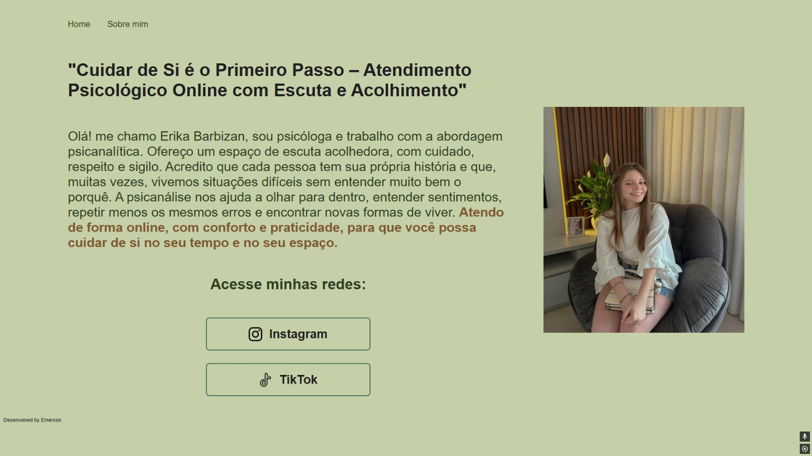

# Site Erika 💖

Este é o **meu primeiro projeto web**, desenvolvido utilizando **HTML** e **CSS**, como parte dos meus estudos nos cursos da [Alura](https://www.alura.com.br).

## 💡 Sobre o projeto

O "Site Erika" é uma homenagem que fiz para a minha namorada, Erika, que sempre me apoiou e me incentivou a seguir estudando programação. Este projeto é uma maneira de expressar minha gratidão e também de aplicar o que aprendi em HTML e CSS, criando uma página pessoal e especial.

## 🚀 Tecnologias utilizadas

- **HTML5**: Estruturação do conteúdo da página.
- **CSS3**: Estilização e design da página para torná-la visualmente agradável.

## 📚 Base de aprendizado

Este projeto foi desenvolvido com base nos cursos introdutórios da Alura, focados em **estruturar páginas com HTML** e **estilizar com CSS**.

## 🌐 Acessando o Site

Você pode visualizar o site diretamente pelo GitHub Pages:

🔗 [https://emersondz.github.io/erika-site](https://emersondz.github.io/erika-site)

Ou abrir o arquivo `index.html` localmente no seu navegador.

## 📸 Imagem do projeto

